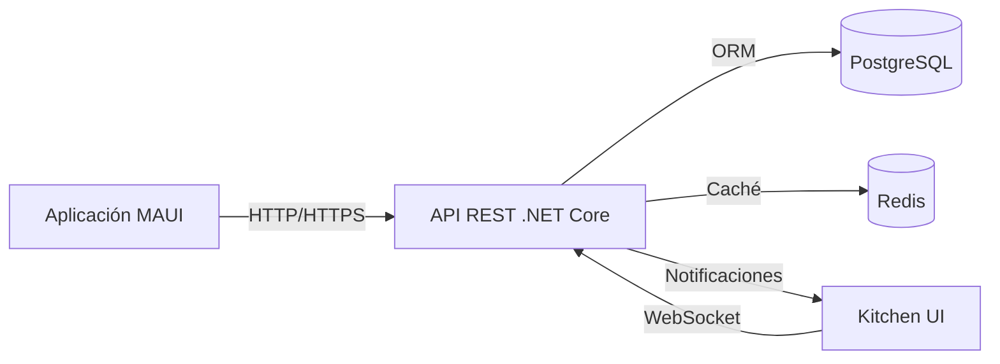

# Arquitectura del Sistema 🏗️

## Diagrama General del Sistema

```mermaid
graph LR
    A[Aplicación MAUI] -->|HTTP/HTTPS| B[API REST .NET Core]
    B -->|ORM| C[(PostgreSQL)]
    B -->|Caché| D[(Redis)]
    B -->|Notificaciones| E[Kitchen UI]
    E -->|WebSocket| B

```